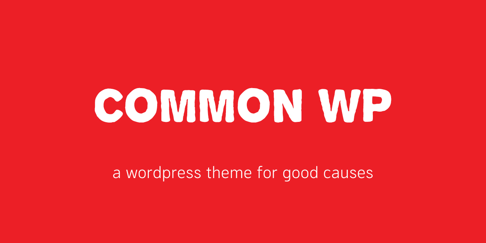

# Common WP Blocks

This is the companion blocks plugin for the [[Common WP]](https://github.com/jcklpe/common-wp) wordpress theme, a simple to use wordpress theme for non-profit use. It's focus is on simple visual design, and clean componentized code for easy customization by organizations with diverse needs.

## Build Process

These blocks are built with webpack as per normal Wordpress Gutenberg Block building practice.

You need basic knowledge of webpack, React, and Gutenberg to make changes to these blocks.

## Requirements

These blocks are intended to be used with the [[Common WP theme]](https://github.com/jcklpe/common-wp).

## TODO:

- [ ] convert all template partials into Gutenberg Blocks to be used in posts
- [ ] build more Blocks to cover additional page designs

## License

This theme uses modified version of GPL 3 which restricts use and distribution of this software to non-profit non-capitalist uses.
